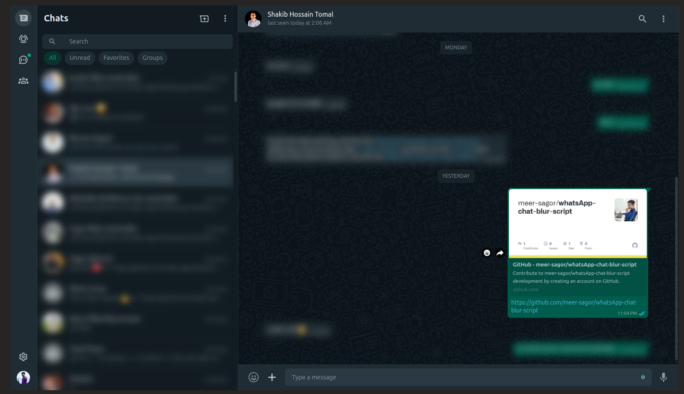

# **Blur Inactive WhatsApp Chats UserScript**

## **Overview**
This UserScript blurs inactive chats and messages in WhatsApp Web, improving privacy. Chats and messages become clear on hover, ensuring a seamless and secure messaging experience.

---

## **Features**
- **Blur inactive chats:** Automatically blurs all inactive chats in the chat list.
- **Blur messages:** Applies a blur effect to incoming (`message-in`) and outgoing (`message-out`) messages.
- **Hover reveal:** Removes the blur effect when you hover over a chat or message.
- **Dynamic updates:** Detects new messages and ensures the blur effect is applied in real time.

---

## **Installation**

### **1. Install a UserScript Manager**
- Download and install a UserScript manager:
  - [Tampermonkey](https://www.tampermonkey.net/)
  - [Violentmonkey](https://violentmonkey.github.io/)

### **2. Install the Script**
- Click on this link to install the script: [Blur Inactive WhatsApp Chats](https://greasyfork.org/en/scripts/519055-blur-inactive-whatsapp-chats)

### **3. Activate the Script**
- Open [WhatsApp Web](https://web.whatsapp.com/).
- The script will automatically blur inactive chats and messages.

---

## License
This script is licensed under the [MIT License](https://github.com/meer-sagor/whatsApp-chat-blur-script?tab=MIT-1-ov-file) You can use, modify, and distribute it freely, provided attribution is given.

## Contributing
Contributions are welcome! Submit [issues](https://github.com/meer-sagor/whatsApp-chat-blur-script/issues) or pull requests to improve this script. Visit the GitHub repository for more details.